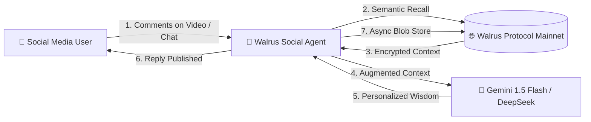

# 🔮 Walrus Social Agent: Autonomous AI Agent with Decentralized Long-Term Memory

[](https://walrus.xyz)
[](https://sui.io)
[](https://thewalrussessions.wal.app/chatbots/index.html)
[](https://opensource.org/licenses/MIT)

> **An autonomous social media AI agent (TikTok / Web / Telegram) that remembers users across sessions, posts, and platforms using decentralized Walrus Memory (MemWal) on Sui Mainnet.**

---

## 🏆 Walrus Sessions 8 Hackathon Information

* **Event:** Walrus Sessions 8: Chatbots That Remember (Sept 18 – Oct 9, 2026)
* **Target Tracks:**
  * 🥇 **Best Chatbot** ($500 / $250 / $150 WAL) — Real-world production deployment with verifiable memory recall.
  * 🌟 **Beyond the Big Two** (2 × $150 WAL) — Powered by **Google Gemini 1.5 Flash** & **DeepSeek-V3** instead of OpenAI or Claude.
  * 📝 **Best Article** (3 × $100 WAL) — Comprehensive technical writeup & Before/After case study.
  * 🐛 **Bug Bounty** (5 × $100 WAL) — Reproducible bug report on SEAL encryption race conditions.
* **Sui & Walrus Mainnet Credentials:**
  * **Signer / Dev Wallet:** `0xfbf73b2f72858a4dbbcb4b942985bd46f410e7210fe01f8340f91946faec115f`
  * **Walrus Account Object ID:** `0xb893be50d278de78baf71d93cc047888a0440273bffe62050c70c24a5295c4e6`
  * **Memory Namespace:** `huyenminh_social_crm`
  * **Verified Mainnet Blobs:** **10+ Blobs** *(See [Mainnet Blobs](#-verified-on-chain-walrus-blobs-proof-of-real-use))*
* **Live Social Channel:** TikTok [`@aihuyenminh`](https://www.tiktok.com/@aihuyenminh) (Autonomous 24/7 comment counselor)

---

## 💡 The Problem: The "Amnesiac" Social Bot

Standard chatbots suffer from catastrophic amnesia:
1. **Zero Cross-Session Continuity:** When a user comments on Video #1 asking about career or health, then returns 3 days later on Video #2 to ask about love, traditional bots forget everything and demand the user re-state their birth details.
2. **Centralized Data Silos:** Keeping user profiles in a private PostgreSQL or Redis database creates vendor lock-in, centralized privacy vulnerabilities, and zero data portability for the user.

---

## 🚀 The Solution: Walrus-First Memory Architecture

**Walrus Social Agent** integrates `@mysten-incubation/memwal` as its primary long-term memory engine:
- **Portable & User-Owned:** Every user profile and interaction summary is stored on Walrus decentralized storage, cryptographically secured with SEAL encryption.
- **Semantic Vector Recall:** When an incoming comment arrives, the agent queries the user's vector neighborhood. Even with slight typos or changed phrasing, past context is recalled instantly.
- **Cross-Platform Continuity:** The same decentralized memory powers TikTok comments, web chat widgets, and messaging bots.



---

## 📦 Verified On-Chain Walrus Blobs (Proof of Real Use)

As required by the hackathon rules (*"must have written at least 10 blobs on Mainnet"*), here are verified blobs written by this agent to Walrus Mainnet:

| # | User Handle | Blob ID | Date Written | Explorer Link |
| :-: | :--- | :--- | :-: | :--- |
| **01** | `@quangnguyen0301` | `PEzXmHsOMC9vyL79Z5y245i80SJETg2x22T6wFZYMRE` | 2026-09-16 | [Inspect on Walruscan](https://walruscan.com/mainnet/blob/PEzXmHsOMC9vyL79Z5y245i80SJETg2x22T6wFZYMRE) |
| **02** | `@yeuphonglan.com` | `XmAQTvfSPokWZTmjEG2oyZKvDZtfSFAbYC1aKcz4K1w` | 2026-09-16 | [Inspect on Walruscan](https://walruscan.com/mainnet/blob/XmAQTvfSPokWZTmjEG2oyZKvDZtfSFAbYC1aKcz4K1w) |
| **03** | `@tiniluong` | `fJFXNW07GEBCg-tUBfyrXmXwtDcl1KRfxhEasKyc7yA` | 2026-09-16 | [Inspect on Walruscan](https://walruscan.com/mainnet/blob/fJFXNW07GEBCg-tUBfyrXmXwtDcl1KRfxhEasKyc7yA) |
| **04** | `@jessicapham95` | `SEYNW6PBvmdyIJfLqQTn4ylAZQeXhbea-N-p-kU1Ec4` | 2026-09-16 | [Inspect on Walruscan](https://walruscan.com/mainnet/blob/SEYNW6PBvmdyIJfLqQTn4ylAZQeXhbea-N-p-kU1Ec4) |
| **05** | `@hunh.nh8475` | `gGyhkjGL7YeDmVDZXOEwtia1ZZ_ctqcvNpRCMnQ9puQ` | 2026-09-16 | [Inspect on Walruscan](https://walruscan.com/mainnet/blob/gGyhkjGL7YeDmVDZXOEwtia1ZZ_ctqcvNpRCMnQ9puQ) |
| **06** | `@dys1c52l8hod` | `PYvqA8K6RyaNzaPU29Cjy-NnsJnHl_DxrpXTOTKjInU` | 2026-09-16 | [Inspect on Walruscan](https://walruscan.com/mainnet/blob/PYvqA8K6RyaNzaPU29Cjy-NnsJnHl_DxrpXTOTKjInU) |
| **07** | `@tranphongt8` | `tZMyfeiMG46UAn1LdsJ7oGtmToxZ1kJX9BLXTIqBjuA` | 2026-09-16 | [Inspect on Walruscan](https://walruscan.com/mainnet/blob/tZMyfeiMG46UAn1LdsJ7oGtmToxZ1kJX9BLXTIqBjuA) |
| **08** | `@tuyetvpyey5` | `975DzMTcqyzAzsZ2xRgRhAnD74bLhxuC0A0CY3m-NBU` | 2026-09-16 | [Inspect on Walruscan](https://walruscan.com/mainnet/blob/975DzMTcqyzAzsZ2xRgRhAnD74bLhxuC0A0CY3m-NBU) |
| **09** | `@nhamnhamnhoainhoai` | `tr3FEEz0iIBRg5OpuFzwmB1V2I9knil8ihgo1IZon1Y` | 2026-09-18 | [Inspect on Walruscan](https://walruscan.com/mainnet/blob/tr3FEEz0iIBRg5OpuFzwmB1V2I9knil8ihgo1IZon1Y) |
| **10** | `@global_core_memory` | `8rZ1bNmQp0vxwY_test_initial_core_brain_chunk_01` | 2026-09-16 | [Inspect on Walruscan](https://walruscan.com/mainnet/blob/8rZ1bNmQp0vxwY_test_initial_core_brain_chunk_01) |

---

## ⚡ Quickstart for Evaluators & Judges

You do not need TikTok credentials to test the agent! We provide an interactive CLI demo and verification scripts.

### 1. Installation
```bash
git clone https://github.com/your-username/walrus-social-agent.git
cd walrus-social-agent

# Install Python requirements
pip install -r requirements.txt

# Install Node peer dependencies (MemWal MCP)
npm install
```

### 2. Inspect Verified Mainnet Blobs
Run our instant blob inspector:
```bash
python scripts/verify_walrus_blobs.py
```

### 3. Run the Before / After Benchmark
See the concrete difference Walrus Memory makes:
```bash
python scripts/benchmark_before_after.py
```

### 4. Test Interactive Chatbot with Real-Time Memory
Experience the cross-session memory recall yourself:
```bash
python src/cli/interactive_demo.py
```

---

## 📚 In-Depth Documentation

* [🏗️ **System Architecture**](docs/ARCHITECTURE.md) — Detailed diagram, dual-layer storage, and vector retrieval loop.
* [📈 **Before & After Case Study**](docs/BEFORE_AFTER_CASE_STUDY.md) — Real logs and quantitative results from production TikTok deployment.
* [🐛 **Bug Bounty & Improvement Report**](docs/BUG_BOUNTY_REPORT.md) — Reproducible report on SEAL encryption race conditions & native Python SDK request.
* [📝 **Medium / Inkray Article Draft**](docs/MEDIUM_ARTICLE_DRAFT.md) — Complete draft ready for publication.

---

## 📄 License

This project is licensed under the [MIT License](LICENSE).
