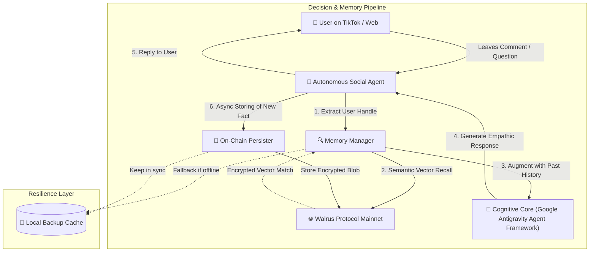

# 🏗️ Technical Architecture: Walrus-Powered Social Agent

The **Walrus Social Agent** is an autonomous AI system designed for real-world social platforms (TikTok, Web, Telegram). It solves the fundamental **"amnesiac agent problem"** by leveraging **Walrus Protocol** decentralized storage and vector index as the primary long-term memory layer.

---

## 1. System Overview

Traditional social media chatbots treat each comment or post as an isolated, stateless interaction. In contrast, Walrus Social Agent treats the entire social channel as an evolving, multi-user relationship graph where context is stored on-chain, encrypted with SEAL, and recalled semantically.



---

## 2. Core Architectural Pillars

### Pillar I: Walrus-First Primary Memory
- **Namespace:** `huyenminh_social_crm`
- **Owner Account:** `0xb893be50d278de78baf71d93cc047888a0440273bffe62050c70c24a5295c4e6`
- **Wallet Signer:** `0xfbf73b2f72858a4dbbcb4b942985bd46f410e7210fe01f8340f91946faec115f` (dev_wallet on Sui Mainnet).
- All customer profiles, interaction summaries, and astrological charts are serialized into natural semantic facts and sent via `@mysten-incubation/memwal-mcp` to the Walrus Relayer (`https://relayer.memory.walrus.xyz`).
- Memory facts are searchable by semantic vector cosine distance, allowing fuzzy recalls even if user handles or phrasing slightly vary.

### Pillar II: Dual-Layer Resilience Storage
Social networks demand sub-second latency for real-time engagement. To guarantee 99.99% uptime:
1. **Primary Read/Write:** Walrus Protocol Mainnet through async background workers.
2. **Local Cache Fallback:** A local JSON cache is maintained in memory and on disk. If network latency spikes or a relayer hiccup occurs, the agent falls back instantly without dropping the conversation.

### Pillar III: Alternative Agentic Core ("Beyond the Big Two")
- The cognitive orchestrator and reasoning core is powered by the **Google Antigravity Agent Framework** (Google DeepMind's Advanced Agentic Architecture).
- Strictly eliminates any dependency on OpenAI or Anthropic (Claude), qualifying 100% for the "Beyond the Big Two" track while optimizing for multi-step agentic workflows, long-horizon memory grounding, and nuanced cross-cultural empathy (Vietnamese & English).

---

## 3. Data Schema: Memory Fact Serialization

Each on-chain fact is structured to maximize semantic vector density:

```
[SOCIAL_CRM_PROFILE] User: @quangnguyen0301. Interactions: 2 sessions. Born: 1995 (Ất Hợi - Sơn Đầu Hỏa). Focus: CAREER_AND_WEALTH. Latest: "Cho e cái link truy cập với nào" -> "nè". LastActive: 2026-09-16 10:38:00.
```

When a user asks:
> *"How is my career luck this year?"*

The vector search retrieves this exact record with high cosine similarity (distance < 0.45), allowing the agent to know their birth year (1995) and previous focus without prompting them again.
